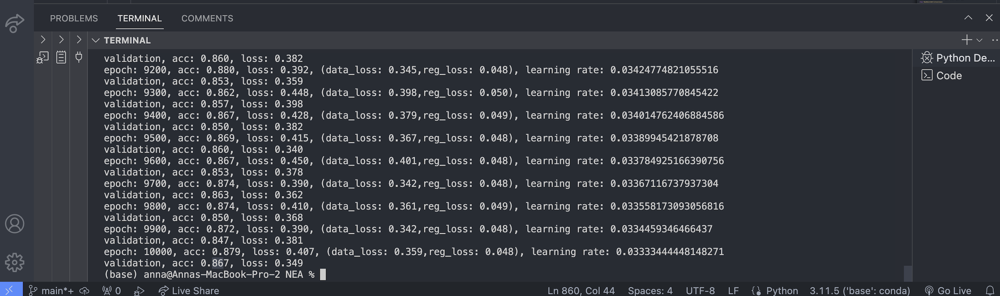

<a id="readme-top"></a>

<!-- PROJECT SHIELDS -->
<!--
*** I'm using markdown "reference style" links for readability.
*** Reference links are enclosed in brackets [ ] instead of parentheses ( ).
*** See the bottom of this document for the declaration of the reference variables
*** for contributors-url, forks-url, etc. This is an optional, concise syntax you may use.
*** https://www.markdownguide.org/basic-syntax/#reference-style-links
-->

<!-- PROJECT LOGO -->
<br />
<div align="center">
  <a href="https://github.com/github_annadaavies/NEA_project/frontend/src/assets/images">
    
  </a>

<h3 align="center">SignIt</h3>

  <p align="center">
    A Bidirectional Sign Language Translation App 
  </p>
</div>

<!-- TABLE OF CONTENTS -->
<details>
  <summary>Table of Contents</summary>
  <ol>
    <li>
      <a href="#about-the-project">About The Project</a>
      <ul>
        <li><a href="#built-with">Built With</a></li>
      </ul>
    </li>
    <li>
      <a href="#getting-started">Getting Started</a>
      <ul>
        <li><a href="#prerequisites">Prerequisites</a></li>
        <li><a href="#installation">Installation</a></li>
      </ul>
    </li>
    <li><a href="#usage">Usage</a></li>
    <li><a href="#roadmap">Roadmap</a></li>
    <li><a href="#contact">Contact</a></li>
    <li><a href="#acknowledgments">Acknowledgments</a></li>
  </ol>
</details>

<!-- ABOUT THE PROJECT -->

## About The Project

<!--[![Product Name Screen Shot][product-screenshot]](https://example.com)-->

According to the World Health Organisation (WHO), currently more than 1.5 billion people (representing approximately 20% of the global population) live with hearing loss. This number is predicted to rise to 2.5 billion by 2050. The deaf and hard of hearing community primarily use a local form of sign language to communicate between themselves. However, with the exception of those individuals and their close friends and family members, most people do not know sign language. This makes communication difficult between hearing and hard of hearing individuals in the broader community. Current workarounds such as writing out or typing text are slow and cumbersome. They interrupt the natural flow of conversation and cause frustration. As researched and presented below, there are very few efficient real-time sign language translation apps available which could lower this communication barrier.

To facilitate improved communication between hearing and hard of hearing individuals, I propose to develop an application that supports two-way translation between American sign language and the English spoken language. Using the built-in phone webcam, hearing impaired users will be able to sign a series of finger-spelt characters that are processed in real-time into English text on a screen. Hearing users will communicate by inputting text or speech that will be converted into sign language gestures performed by a virtual avatar. This project ultimately aims to provide a communication platform between the hearing and the hearing impaired, where everyone is able to communicate in the manner that comes most naturally to them.

<p align="right">(<a href="#readme-top">back to top</a>)</p>

### Built With

- 
- 
- 

<p align="right">(<a href="#readme-top">back to top</a>)</p>

<!-- GETTING STARTED -->

## Getting Started

Detailed below are the instructions for executing the application.

### Prerequisites

Listed below are all installments **required** to run the code. Optional additions - mainly to aid visualisation of neural network and image processing components - are detailed in the requirements.txt file.

- Numpy
  ```sh
  pip3 install numpy
  ```
- OpenCV
  ```sh
  pip3 install opencv-python
  ```

### Installation

2. Clone the repository
   ```sh
   git clone https://github.com/annadaavies/NEA_project
   ```
3. Install prerequisite packages as written above
4. Change git remote url to avoid accidental pushes to base project
   ```sh
   git remote set-url origin github_username/repo_name
   git remote -v # confirm the changes
   ```
5. Run the 'neural_network_final_spiral_data.py' file (Neural Network --> Version 2 (numpy) --> neural_network_final_spiral_data.py')

<p align="right">(<a href="#readme-top">back to top</a>)</p>

<!-- USAGE EXAMPLES -->

## Usage

@ChrisHallHK - As noted at the top of the 'neural_network_final_spiral_data.py' file, I am currently working on formatting my kaggle data set (87,000 images!) such that I can train my final model once we return to school on a school computer. The spiral_data() function is not my own code. It is temporary so that you are able to run the program with a random set of neural network data and see that it is able to adjust learning rate, improve accuracy, and decrease loss.

The image below shows how, on a set of randomly generated spiral data, the neural network outputs updates on accuracy, loss, and learning rate as it increments its steps (epochs) through training data.



<p align="right">(<a href="#readme-top">back to top</a>)</p>

<!-- ROADMAP -->

## Roadmap

- [x] Neural Network
  - [x] Neural Network Layer Classes
  - [x] Neural Network Activation Classes
  - [x] Neural Network Loss Classes
  - [x] Neural Network Optimiser Classes
  - [x] Neural Network Model Class
- [x] Dataset Mass Formatting
- [ ] Neural Network Model Training
- [ ] OpenCV Image Formatting
- [ ] Dictionary Conversion
- [ ] GUI Interface

<p align="right">(<a href="#readme-top">back to top</a>)</p>

<!-- CONTACT -->

## Contact

Anna Davies - adavies@kellettschool.com

<p align="right">(<a href="#readme-top">back to top</a>)</p>

<!-- ACKNOWLEDGMENTS -->

## Acknowledgments

- [othneildrew's README.md Template](https://github.com/othneildrew/Best-README-Template/tree/main)
- []()
- []()

<p align="right">(<a href="#readme-top">back to top</a>)</p>

<!-- MARKDOWN LINKS & IMAGES -->
<!-- https://www.markdownguide.org/basic-syntax/#reference-style-links -->

[product-screenshot]: images/screenshot.png
[Python]: 
[Python-url]: https://docs.python.org/3/
[Numpy]: https://upload.wikimedia.org/wikipedia/commons/thumb/3/31/NumPy_logo_2020.svg/1024px-NumPy_logo_2020.svg.png
[Numpy-url]: https://numpy.org/doc/
[OpenCV]: https://miro.medium.com/v2/resize:fit:2000/format:webp/1*S8Il5ethl3YFh0M9XKVz-A.png
[OpenCV-url]: https://docs.opencv.org/4.x/index.html
