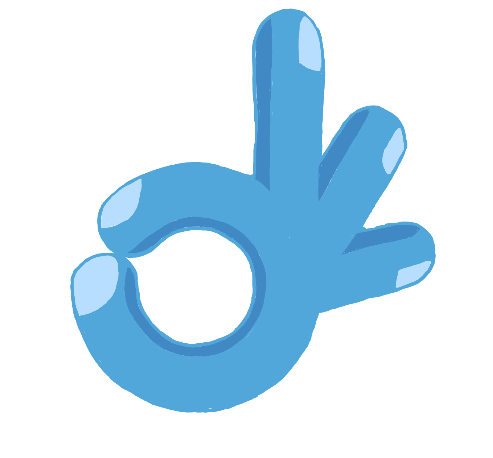

<a id="readme-top"></a>


<!-- PROJECT SHIELDS -->
<!--
*** I'm using markdown "reference style" links for readability.
*** Reference links are enclosed in brackets [ ] instead of parentheses ( ).
*** See the bottom of this document for the declaration of the reference variables
*** for contributors-url, forks-url, etc. This is an optional, concise syntax you may use.
*** https://www.markdownguide.org/basic-syntax/#reference-style-links
-->


<!-- PROJECT LOGO -->
<br />
<div align="center">
  <a href="https://github.com/github_annadaavies/NEA_project">
    
  </a>

<h3 align="center">SignIt</h3>

  <p align="center">
    A Bidirectional Sign Language Translation App 
  </p>
</div>


<!-- TABLE OF CONTENTS -->
<details>
  <summary>Table of Contents</summary>
  <ol>
    <li>
      <a href="#about-the-project">About The Project</a>
      <ul>
        <li><a href="#built-with">Built With</a></li>
      </ul>
    </li>
    <li>
      <a href="#getting-started">Getting Started</a>
      <ul>
        <li><a href="#prerequisites">Prerequisites</a></li>
        <li><a href="#installation">Installation</a></li>
      </ul>
    </li>
    <li><a href="#usage">Usage</a></li>
    <li><a href="#roadmap">Roadmap</a></li>
    <li><a href="#contact">Contact</a></li>
    <li><a href="#acknowledgments">Acknowledgments</a></li>
  </ol>
</details>


<!-- ABOUT THE PROJECT -->
## About The Project

[![Product Name Screen Shot][product-screenshot]](https://example.com)

According to the World Health Organisation (WHO), currently more than 1.5 billion people (representing approximately 20% of the global population) live with hearing loss. This number is predicted to rise to 2.5 billion by 2050. The deaf and hard of hearing community primarily use a local form of sign language to communicate between themselves. However, with the exception of those individuals and their close friends and family members, most people do not know sign language. This makes communication difficult between hearing and hard of hearing individuals in the broader community. Current workarounds such as writing out or typing text are slow and cumbersome. They interrupt the natural flow of conversation and cause frustration. As researched and presented below, there are very few efficient real-time sign language translation apps available which could lower this communication barrier. 

To facilitate improved communication between hearing and hard of hearing individuals, I propose to develop an application that supports two-way translation between American sign language and the English spoken language. Using the built-in phone webcam, hearing impaired users will be able to sign a series of finger-spelt characters that are processed in real-time into English text on a screen. Hearing users will communicate by inputting text or speech that will be converted into sign language gestures performed by a virtual avatar. This project ultimately aims to provide a communication platform between the hearing and the hearing impaired, where everyone is able to communicate in the manner that comes most naturally to them. 


<p align="right">(<a href="#readme-top">back to top</a>)</p>


### Built With

* 
* 
* 


<p align="right">(<a href="#readme-top">back to top</a>)</p>


<!-- GETTING STARTED -->
## Getting Started

Detailed below are the instructions for executing the application. 

### Prerequisites

Listed below are all installments **required** to run the code. Optional additions - mainly to aid visualisation of neural network and image processing components - are detailed in the requirements.txt file. 

* Numpy
  ```sh
  pip3 install numpy
  ```
* OpenCV
  ```sh
  pip3 install opencv-python
  ```

### Installation

1. Get a free API Key at [https://example.com](https://example.com)
2. Clone the repo
   ```sh
   git clone https://github.com/github_username/repo_name.git
   ```
3. Install NPM packages
   ```sh
   npm install
   ```
4. Enter your API in `config.js`
   ```js
   const API_KEY = 'ENTER YOUR API';
   ```
5. Change git remote url to avoid accidental pushes to base project
   ```sh
   git remote set-url origin github_username/repo_name
   git remote -v # confirm the changes
   ```

<p align="right">(<a href="#readme-top">back to top</a>)</p>


<!-- USAGE EXAMPLES -->
## Usage

Use this space to show useful examples of how a project can be used. Additional screenshots, code examples and demos work well in this space. You may also link to more resources.

_For more examples, please refer to the [Documentation](https://example.com)_

<p align="right">(<a href="#readme-top">back to top</a>)</p>


<!-- ROADMAP -->
## Roadmap

- [ ] Feature 1
- [ ] Feature 2
- [ ] Feature 3
    - [ ] Nested Feature

See the [open issues](https://github.com/github_username/repo_name/issues) for a full list of proposed features (and known issues).

<p align="right">(<a href="#readme-top">back to top</a>)</p>


<!-- CONTRIBUTING -->
## Contributing

Contributions are what make the open source community such an amazing place to learn, inspire, and create. Any contributions you make are **greatly appreciated**.

If you have a suggestion that would make this better, please fork the repo and create a pull request. You can also simply open an issue with the tag "enhancement".
Don't forget to give the project a star! Thanks again!

1. Fork the Project
2. Create your Feature Branch (`git checkout -b feature/AmazingFeature`)
3. Commit your Changes (`git commit -m 'Add some AmazingFeature'`)
4. Push to the Branch (`git push origin feature/AmazingFeature`)
5. Open a Pull Request

<p align="right">(<a href="#readme-top">back to top</a>)</p>

### Top contributors:

<a href="https://github.com/github_username/repo_name/graphs/contributors">
  
</a>


<!-- LICENSE -->
## License

Distributed under the project_license. See `LICENSE.txt` for more information.

<p align="right">(<a href="#readme-top">back to top</a>)</p>


<!-- CONTACT -->
## Contact

Your Name - [@twitter_handle](https://twitter.com/twitter_handle) - email@email_client.com

Project Link: [https://github.com/github_username/repo_name](https://github.com/github_username/repo_name)

<p align="right">(<a href="#readme-top">back to top</a>)</p>


<!-- ACKNOWLEDGMENTS -->
## Acknowledgments

* []()
* []()
* []()

<p align="right">(<a href="#readme-top">back to top</a>)</p>


<!-- MARKDOWN LINKS & IMAGES -->
<!-- https://www.markdownguide.org/basic-syntax/#reference-style-links -->
[product-screenshot]: images/screenshot.png
[Python]: 
[Python-url]: https://docs.python.org/3/ 
[Numpy]: https://upload.wikimedia.org/wikipedia/commons/thumb/3/31/NumPy_logo_2020.svg/1024px-NumPy_logo_2020.svg.png
[Numpy-url]: https://numpy.org/doc/
[OpenCV]: https://miro.medium.com/v2/resize:fit:2000/format:webp/1*S8Il5ethl3YFh0M9XKVz-A.png
[OpenCV-url]: https://docs.opencv.org/4.x/index.html

